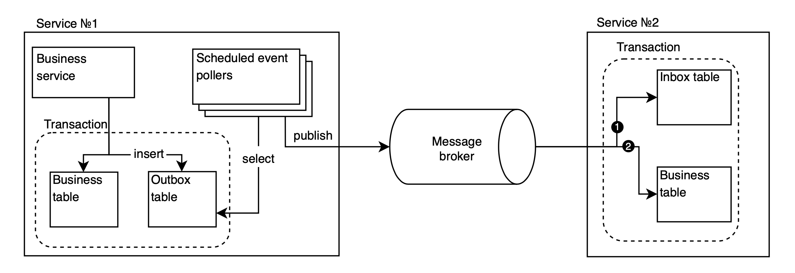

[](https://www.codefactor.io/repository/github/dmitriy-iliyov/spring-outbox)
[](https://codecov.io/github/dmitriy-iliyov/spring-outbox)
[](https://github.com/dmitriy-iliyov/spring-outbox/actions/workflows/ci.yml)


## Overview
This library provides an implementation of the [Transactional Outbox Pattern](https://microservices.io/patterns/data/transactional-outbox.html) based on polling events from a relational database and publishing them to a message broker.

The library offers flexible configuration for processing different event types.
Each event type is handled independently, and events are processed in parallel using a configurable thread pool, allowing predictable throughput and controlled resource usage.

Two delivery guarantees are supported:
- **At-least-once delivery**
- **Exactly-once delivery**, achieved through an idempotent consumer implementation provided by the library

This approach ensures reliable event publication without relying on database log-based CDC solutions, making it suitable for environments where simplicity, portability, and explicit control over event processing are preferred.

## Key Features
- Atomic event storage within business transactions
- Scheduled polling and publishing to message broker
- Configurable retry policies with backoff
- Dead Letter Queue support
- Automatic stuck event recovery
- Automatic cleanup of processed events
- Idempotent event consumption
- Automatic cleanup of consumed events

## Limitations
- **Horizontal scaling** - performance degradation may occur when reaching a certain number of instances due to `SKIP LOCKED`-based concurrent polling mechanism. The optimal number of instances depends on the number of event types and database load.
- **No ordering guarantees** - events are processed in parallel by type, with no guaranteed delivery order within or across event types.

## Infrastructure

**Supported Databases:**
- PostgreSQL 16+
- MySQL 8+
- Oracle Database 23+

**Supported Message Brokers:**
- Apache Kafka 3.7
- RabbitMQ 3.12

**Cache Storage (optional for caching):**
- Redis 7+

## Quick Start

1. Enable starter on publisher side:
```java
@SpringBootApplication
@EnableJpaRepositories
@EnableTransactionManagement
@EnableKafka        // or @EnableRabbit for RabbitMQ
@EnableOutbox
public class PublisherRunner {

    public static void main(String ... args) {
        SpringApplication.run(PublisherRunner.class, args);
    }
}
```
2. Minimal YAML config (**DLQ disabled by default**):
```yaml
outbox:
  publisher:
    sender:
      type: kafka    # or rabbit_mq
    events:
      create-example-event:
        topic: "example-events"
```
3. Inject `OutboxPublisher`:
```java 
@Service
@RequiredArgsConstructor
public class ExampleService {

    private final ExampleRepository repository;
    private final ExampleMapper mapper;
    private final OutboxPublisher outboxPublisher;
    
    @Transactional
    public ExampleDto save(ExampleCreateDto dto) {
        ExampleEntity entity = repository.save(mapper.toEntity(dto));
        ExampleDto response = mapper.toDto(entity);
        outboxPublisher.publish("create-example-event", response);
        return response;
    }
}
```

Or use `@OutboxPublish` annotation:

```java
@Service
@RequiredArgsConstructor
public class ExampleService {

    private final ExampleRepository repository;
    private final ExampleMapper mapper;

    @Transactional
    @OutboxPublish(eventType = "create-example-event")    // payload by default is "#result"
    public ExampleDto save(ExampleCreateDto dto) {
        ExampleEntity entity = repository.save(mapper.toEntity(dto));
        return mapper.toDto(entity);
    }
}
```

4. Enable starter on consumer side:
```java
@SpringBootApplication
@EnableJpaRepositories
@EnableTransactionManagement
@EnableKafka        // or @EnableRabbit for RabbitMQ
@EnableCaching
@EnableOutbox
public class ConsumerRunner {

    public static void main(String [] args) {
        SpringApplication.run(ConsumerRunner.class, args);
    }
}
```
5. Minimal YAML config (clean-up and cache enable by default):
```yaml
outbox:
  publisher:
    enabled: false
  consumer:
    enabled: true
    cache:
      cache-name: "outbox:consumed"
```

6. Create listener with injected `OutboxIdempotentConsumer`:

**Apache Kafka:**
```java
@Component
@RequiredArgsConstructor
@Slf4j
public class ExampleKafkaListener {

    private final OutboxIdempotentConsumer outboxConsumer;

    @KafkaListener(topics = "example-events", groupId = "example-group")
    public void listen(ConsumerRecord<String, ExampleDto> record) {
        outboxConsumer.consume(
                record,    // event metadata (type, id) is in headers
                () -> log.info("Some business operation with payload {}", record.value())
        );
    }
}
```

**RabbitMQ:**
```java
@Component
@RequiredArgsConstructor
@Slf4j
public class ExampleRabbitListener {

    private final OutboxIdempotentConsumer outboxConsumer;
    private final ObjectMapper objectMapper;
    
    @RabbitListener(queues = "example-queue")
    public void handle(Message message) {
      ExampleDto dto = objectMapper.readValue(message.getBody(), ExampleDto.class);
      outboxConsumer.consume(
            message,    // event metadata (type, id) is in headers
            () -> log.info("Some business operation with payload {}", dto)
        );
    }
}
```

More about event metadata [here](#event-headers)

---

## Example & Test Environment

Example of full configured project with simple traffic generator is [here](https://github.com/dmitriy-iliyov/spring-outbox/tree/main/spring-outbox-example). Project is fully containerised with Docker.

## Design

### Architecture Overview

The system architecture with full configuration looks as follows:



The event lifecycle follows these steps:
1. Event or batch of events is created
2. Scheduled procedure polls a batch of events by type
3. Attempt to publish the batch:
    - On success: batch is marked as processed
    - On failure: configured number of retries is performed for this event type
        - When retries are exhausted: event is atomically moved to DLQ
4. Event is placed in the message queue

The following flow applies only when using the idempotent consumer:
1. Consumer receives an event or batch of events
2. Consumption check is performed (all subsequent steps are atomic):
    - If event was already consumed: business action is not executed and no exceptions are thrown
        - For batch consumption: events are filtered and business operation executes only for unconsumed events
    - If event was not consumed: event is marked as consumed and business operation is executed

---

### Polling Mechanism

The polling mechanism is based on selecting events by type, sorted by creation date (or by retry date after the first failed delivery attempt).
Events of different types can be processed in parallel using threads from a dedicated library-managed thread pool (you can manage this with `thread-pool-size`).
Detailed configuration options and recommendations for pool size are [here](#global).

To enable parallel event processing across multiple application instances, the library uses `FOR UPDATE SKIP LOCKED`, which allows concurrent processing of event batches. This architectural decision has two drawbacks:
- Performance degrades as the number of instances increases due to longer search times for available event batches
- Event processing order cannot be guaranteed

---

### Delivery Semantics
 
**WARNING:** The library expects the message broker to be configured by the developer.
To ensure the delivery semantics described below, the broker must be configured with `acks` (or an equivalent mechanism).
If the broker uses a producer-side buffer, its settings should also be tuned appropriately for the expected load.

#### At-Least-Once

This delivery semantic is ensured without consumer-side configuration. The publisher waits for successful acknowledgment from the queue confirming event receipt.

If the publisher crashes after polling but before sending to the queue, events become stuck in `IN_PROCESS` state. They will be detected by a dedicated worker and transitioned back to `PENDING` state without counting the failed delivery attempt.

More details about the state machine [here](#event-state-machine).

#### Exactly-Once
This semantic is achievable only when using the idempotent consumer, which deduplicates messages based on event identifiers generated when the event is initially saved at the beginning of its lifecycle.

In reality, the term "Exactly-Once" is not entirely accurate and should be understood as "Effectively-Exactly-Once", since the library cannot guarantee deduplication within the broker itself.

---

### Publisher

#### Usage
There are two options for use:
- manual using `OutboxPublisher#publish()`
```java
public interface OutboxPublisher {
  <T> void publish(String eventType, T event);
  <T> void publish(String eventType, List<T> events);
}
```
- using an `@OutboxPublish` annotation
```java
@Retention(RetentionPolicy.RUNTIME)
@Target(ElementType.METHOD)
@Documented
public @interface OutboxPublish {
  String eventType();
  @Language("SpEL")
  String payload() default "#result";
}
```
Both approaches require specifying the eventType in accordance with the YAML configuration and support saving events in batches.
When using the annotation-based approach, the payload can be derived from method parameters or the return value and is configured via SpEL expressions (e.g. by referencing a parameter name).
More usage examples [here](https://github.com/dmitriy-iliyov/spring-outbox/blob/main/spring-outbox-example/spring-outbox-publisher-example/src/main/java/io/github/dmitriyiliyov/springoutbox/example/publisher/OrderService.java).

---

#### Event State Machine
Events transition through the following states:
```text
PENDING → IN_PROCESS → PROCESSED (future cleanup)
               ↓
             FAILED (after max retries exhausted)
```
- `PENDING`: event created and waiting to be polled
- `IN_PROCESS`: event currently being processed by a publisher instance, if the publisher crashes, the event will remain in this state. This is an intermediate state that signals that an event has been accepted for processing by a worker. All workers except for [stuck event recovery](#stuck-event-recovery) do not work with this status. The state is assigned after a transaction locks a row in the database via FOR UPDATE.
- `PROCESSED`: event successfully sent to message broker
- `FAILED`: event failed after exhausting all retry attempts

---

#### Transactional Guarantees
The library ensures atomic storage of outbox events within the same database transaction as business entity modifications. This guarantees that either both the business change and the event are saved, or neither is saved, preventing inconsistencies between the database and message broker.

All methods for saving simultaneously with a business event are annotated with `@Transactional(propagation = Propagation.MANDATORY)`, which means that the transaction is mandatory and is opened by the client code.

---

#### Retry Policy
An exponential backoff is supported where the delay increases exponentially with each retry, the next retry attempt is calculated using the following formula:

`next_retry_at = initial_delay * (multiplier ^ retry_attempt)`

Example: 10s -> 30s -> 90s -> 270s...

Detailed configuration options are available [here](#defaults--events).

---

#### Stuck Event Recovery
Events that are in the `IN_PROCESS` state for more than the specified threshold (`max-batch-processing-time` in the configuration) are considered stuck, they are caught by the worker and transferred to the `PENDING` state **without increasing the number of failed attempts**.

Detailed configuration options are available [here](#stuck-event-recovery-1).

---

#### Dead Letter Queue

The Dead Letter Queue (DLQ) is implemented using the database. As described above, events are automatically moved to the DLQ once they are marked with the `FAILED` status after the maximum number of retry attempts is exceeded.

Events placed into the DLQ must be **manually reviewed**. After review, an event can be marked as either `TO_RETRY` or `RESOLVED`.  
To support this workflow, the library provides a **REST API** for DLQ management with the following capabilities.

Each DLQ event follows a defined state machine:
```text
MOVED → IN_PROCESS → RESOLVED (future cleanup or manually delete)
            ↓
         TO_RETRY (returned to outbox_events and deleted from outbox_dlq_events)
```
State definitions:

- `MOVED`: the event has been transferred from `outbox_events` to the DLQ and is waiting for manual review
- `IN_PROCESS`: the event is currently being processed by a DLQ transfer worker
- `TO_RETRY`: the event has been reviewed and approved for retry; it will be moved back to `outbox_events`
- `RESOLVED`: the event is considered permanently failed and will not be retried

##### DLQ Transfer Semantics

Event transfers between `outbox_events` and `outbox_dlq_events` are performed **within a single database transaction** to ensure consistency:

- start transaction
    - load a batch of DLQ events and lock them by setting status to `IN_PROCESS` to prevent concurrent handling
    - insert events into the target table
    - delete the corresponding batch from the source table
- commit transaction

This guarantees atomicity and prevents event duplication or loss during DLQ transitions.

There is a handler interface that is invoked when events are transferred from the `outbox_events` table to the `outbox_dlq_events` table.
It can be used to integrate alerting or monitoring.
By default, it simply logs the events moved to the DLQ.
```java
public interface OutboxDlqHandler {
    void handle(List<OutboxEvent> events);
}
```

##### DLQ REST API
The Dead Letter Queue provides a REST API for managing events that have failed delivery or require manual review.

**WARNING:** you should secure DLQ REST API paths.

| Method | Path | Params | Request Body | Description |
|--------|------|--------|--------------|-------------|
|  | `/api/outbox-dlq/events/{id}` | id: UUID | — | Get DLQ event by ID |
|  | `/api/outbox-dlq/events` | status: DlqStatus,<br/>batchNumber: int,<br/>batchSize: int | — | Get batch of DLQ events |
|  | `/api/outbox-dlq/events/{id}` | id: UUID | status: DlqStatus | Update single DLQ event status |
|  | `/api/outbox-dlq/events` | — | ids: Set&lt;UUID&gt;,<br/>status: DlqStatus | Update batch DLQ events status |
|  | `/api/outbox-dlq/events/{id}` | id: UUID | — | Delete single DLQ event |
|  | `/api/outbox-dlq/events` | — | ids: Set&lt;UUID&gt; | Delete batch of DLQ events |

Detailed DLQ configuration options are available [here](#dead-letter-queue-1).

---

#### Cleanup

Outbox events with the `PROCESSED` status are periodically cleaned up by a background worker according to the configured retention policy.
Detailed configuration options are available [here](#cleanup-2).

---

### Consumer

#### Usage
The consumer side of the library provides only manual invocation through the following interface:
```java
public interface OutboxIdempotentConsumer {
    <T> void consume(T message, Runnable operation);
    <T> void consume(List<T> messages, Consumer<List<T>> operation);
}
```
More usage examples [here](https://github.com/dmitriy-iliyov/spring-outbox/blob/main/spring-outbox-example/spring-outbox-consumer-example/src/main/java/io/github/dmitriyiliyov/springoutbox/example/consumer/OrderAnalyticKafkaListener.java)

---

#### Idempotent Processing
Idempotent processing is implemented through unique event identifiers that are stored in a dedicated table when consumed. Storage occurs atomically together with the business effect.

Event identifiers are passed via message headers to avoid polluting business events, so you should use for:
- Apache Kafka - `org.apache.kafka.clients.consumer.ConsumerRecord`
- RabbitMQ - `org.springframework.amqp.core.Message`

As mentioned earlier, when consuming a batch of events, already-consumed events are filtered out and only unconsumed events are passed to the lambda expression.

For improved performance, consumed event identifiers can be cached in a distributed cache. When using this feature, ensure that cleanup of successfully processed events occurs after cache cleanup to prevent data loss.
The library uses `CacheManager` from the application context. Cache configuration must be provided by the developer.

---

##### Event Headers

**IMPORTANT:** The library uses message headers to pass event metadata for idempotency checks and routing.

The event types themselves act as routing keys in both cases. For **Apache Kafka**, they are placed in event headers and are available for consumer-side routing. For **RabbitMQ**, they are used by the library itself to determine the queue to which the event will be sent and are also available in the headers.

All events published through the outbox pattern include the following headers:

| Header Name | Constant | Type | Description                                                                               |
|------------|----------|------|-------------------------------------------------------------------------------------------|
| `outbox_event_type` | `OutboxHeaders.EVENT_TYPE` | String | Enables event dispatching when multiple event types share a topic/exchange                |
| `outbox_event_id` | `OutboxHeaders.EVENT_ID` | UUID | Unique event identifier for idempotency, used by OutboxIdempotentConsumer implementation |                                                                                               |

```java
public enum OutboxHeaders {
  EVENT_TYPE("outbox_event_type"),
  EVENT_ID("outbox_event_id");

  private final String value;

  OutboxHeaders(String value) {
    this.value = value;
  }

  public String getValue() {
    return value;
  }
}
```

**Apache Kafka:**
```java
@Component
@RequiredArgsConstructor
@Slf4j
public class OrderKafkaListener {

  private final OutboxIdempotentConsumer outboxConsumer;

  // Map containing event type to handler strategy mapping
  private final Map<String, OrderEventHandler> handlers;

  @KafkaListener(topics = "orders", groupId = "order-group")
  public void listen(ConsumerRecord<String, OrderDto> record) {
    String eventType = new String(
            record.headers()
                    .lastHeader(OutboxHeaders.EVENT_TYPE.getValue())
                    .value()
    );

    outboxConsumer.consume(record, () -> {
      OrderEventHandler handler = handlers.get(eventType);
      if (handler != null) {
        handler.handle(record);
      }
    });
  }
}
```

**RabbitMQ:**
```java
@Component
@RequiredArgsConstructor
@Slf4j
public class OrderRabbitListener {

  private final OutboxIdempotentConsumer outboxConsumer;

  // Map containing event type to handler strategy mapping
  private final Map<String, OrderEventHandler> handlers;

  @RabbitListener(bindings = @QueueBinding(
          value = @Queue("order-processing-queue"),
          exchange = @Exchange(name = "orders", type = ExchangeTypes.TOPIC),
          key = {"order-created", "order-updated"}
  ))
  public void handleOrders(Message message) {
    String eventType = (String) message.getMessageProperties()
            .getHeaders()
            .get(OutboxHeaders.EVENT_TYPE.getValue());

    outboxConsumer.consume(message, () -> {
      OrderEventHandler handler = handlers.get(eventType);
      if (handler != null) {
        handler.handle(message);
      }
    });
  }
}
```
---

#### Cleanup
The automatic cleanup strategy for consumed events is identical to the publisher cleanup strategy described [above](#cleanup).

---

## Observability
### Publisher

**Gauges**
- `outbox_events`: total number of outbox events

- `outbox_events_by_status`: number of outbox events
    - **Tags:** `status={pending, in_process}`

- `outbox_events_by_event_type_and_status`: number of outbox events by type
    - **Tags:** `event_type`, `status={pending, in_process}`

- `outbox_dlq_events`: total number of events in DLQ

- `outbox_dlq_events_by_status`: number of outbox DLQ events by status
    - **Tags:** `status={moved, in_process, to_retry}`

- `outbox_dlq_events_by_event_type_and_status`: number of outbox DLQ events by type and status
    - **Tags:** `event_type`, `status={moved, in_process, to_retry}`

All gauges execute `COUNT` queries against the database and therefore reflect the **exact number of events at the current moment**.

To avoid excessive database load caused by Prometheus scraping, gauge values are **cached by default**.
Caching can be disabled via metrics configuration.

**Counters**
- `outbox_events_rate_total`: number of events successfully processed or failed during consumption
    - **Tags:** `event_type`, `status={processed, failed}`

- `outbox_events_by_type_rate_total`: internal lifecycle counters, including
    - **Tags:** `type={attempt_move_to_dlq, recovered, cleaned, success_moved_to_dlq}`

- `outbox_dlq_events_rate_total`: rate of DLQ state transitions per event type
    - **Tags:** `event_type`, `status={moved, in_process, to_retry}`

- `outbox_dlq_events_by_type_rate_total`: operational counters for DLQ management
    - **Tags:** `type={attempt_move_to_outbox, success_moved_to_outbox, manual_deleted}`

**Timers**
- `outbox_dlq_transfer_to_duration`: duration of batch transfers from outbox to DLQ

- `outbox_dlq_transfer_from_duration`: duration of batch transfers from DLQ back to outbox

These timers help identify performance bottlenecks during bulk recovery or DLQ reprocessing operations.

---

### Consumer

**Counters**
- `consumed_outbox_events_total`: number of outbox events by type
    - **Tags:** `type={duplicated, consumed, cleaned, failed, cache-hit, cache-miss}`

## Configuration
### Global

```yaml
outbox:
  thread-pool-size: 5  # min(available_processors, 5)
  tables:
    auto-create: true
```

- `thread-pool-size`: size of the thread pool used for parallel event processing by type
    - **Default**: `min(available_processors, 5)`
    - **Description**: events of different types are processed in parallel using threads from this pool. Scale based on number of event types and system resources. The number should be calculated by the user based on the required processing frequency. You should also remember to leave at least one (and preferably two) threads for system workers such as cleanup, catching stuck workers, and transferring to the DLQ.

- `auto-create`: automatically create outbox tables on application startup
    - **Default**:`true`
    - **Description**: when enabled, the library creates `outbox_events`, `outbox_dlq_events`, and `outbox_consumed_events` tables with appropriate indexes if they don't exist

### Publisher

#### Sender
```yaml
outbox:
  publisher:
    sender:
      type: kafka  # or rabbit_mq
      bean-name: "customKafkaTemplate"  # optional
      emergency-timeout: 120s
```

- `type`: message broker type (**required**)
    - **Values**: [`kafka`, `rabbit_mq`]
- `bean-name`: custom sender bean name (**optional**)
    - **Description**: use when you have multiple sender beans in the context.
- `emergency-timeout`: maximum time to wait for send operation
    - **Default**: `120s`
    - **Description**: timeout for message broker send operations. If exceeded, operation is cancelled and event marked `FAILED`.

---
#### Defaults & Events

The `defaults` section defines default values that apply to all events unless overridden in individual event configuration.
```yaml
outbox:
  publisher:
    defaults:
      batch-size: 50
      initial-delay: 300s
      fixed-delay: 2s
      max-retries: 3
      backoff:
        enabled: true
        delay: 10s
        multiplier: 3
```

- `batch-size`: number of events to poll and process per iteration
    - **Default**: `50`
    - **Description**: larger batches improve throughput but increase memory usage
- `initial-delay`: delay before first polling starts after application startup
    - **Default**: `300s`
    - **Description**: gives application time to fully initialize before starting event processing
- `fixed-delay`: interval between polling iterations
    - **Default**: `2s`
    - **Description**: lower values reduce latency but increase database load
- `max-retries`: maximum retry attempts before moving to DLQ
    - **Default**: `3`
    - **Description**: total retry attempts before moving to DLQ
- `backoff.enabled`: enable exponential backoff
    - **Default**: `true`
    - **Description**: when enabled, delay between retries increases exponentially
- `backoff.delay`: initial backoff delay
    - **Default**: `10s`
    - **Description**: base delay for exponential backoff calculation
- `backoff.multiplier`: exponential backoff multiplier
    - **Default**: `3`
    - **Description**: each retry delay = previous_delay * multiplier

Individual event configurations override defaults for specific event types.
```yaml
outbox:
  publisher:
    events:
      order-created:
        topic: "orders"
        batch-size: 100
        fixed-delay: 1s
        max-retries: 5
        backoff:
          delay: 5s
          multiplier: 2
      
      order-updated:
        topic: "orders"
        batch-size: 50
        fixed-delay: 2s
        backoff:
          enabled: false  # Use fixed delay instead
      
      notification-sent:
        topic: "notifications"
        # Other params inherited from defaults
```

- `topic`: destination topic (Kafka) or exchange (RabbitMQ) name

All other parameters same as `defaults` section, but override defaults for this specific event type

**Example with inheritance from `defaults`:**
```yaml
outbox:
  publisher:
    defaults:
      batch-size: 50
      fixed-delay: 2s
      max-retries: 3
    
    events:
      high-priority:
        topic: "events"
        fixed-delay: 1s  # Override: faster polling
        # Inherits: batch-size=50, max-retries=3
      
      low-priority:
        topic: "events"
        fixed-delay: 10s  # Override: slower polling
        backoff:
          enabled: false  # Override: disable backoff
        # Inherits: batch-size=50, max-retries=3
```
---

#### Stuck Event Recovery
```yaml
outbox:
  publisher:
    stuck-recovery:
      batch-size: 100
      max-batch-processing-time: 300s
      initial-delay: 300s
      fixed-delay: 1800s
```

- `batch-size`: number of stuck events to recover per iteration
    - **Default**: `100`
- `max-batch-processing-time`: time threshold for detecting stuck events
    - **Default**: `300s`
    - **Description**: events in `IN_PROCESS` status longer than this are considered stuck
- `initial-delay`: delay before first recovery run
    - **Default**: `300s`
- `fixed-delay`: interval between recovery runs
    - **Default**: `1800s`

---

#### Dead Letter Queue
```yaml
outbox:
  publisher:
    dlq:
      enabled: true
      batch-size: 100
      transfer-to-initial-delay: 300s
      transfer-to-fixed-delay: 900s
      transfer-from-initial-delay: 300s
      transfer-from-fixed-delay: 3600s
      metrics:
        gauge:
          enabled: true
          cache:
            ttls: [60s, 60s, 60s]
```

- `enabled`: enable DLQ functionality
    - **Default**: `false`
    - **Warning**: when disabled, failed events are not managed automatically and stay in `outbox_events` as `FAILED`
- `batch-size`: number of events to transfer per iteration
    - **Default**: `100`
- `transfer-to-initial-delay`: delay before first transfer **to** DLQ
    - **Default**: `300s`
- `transfer-to-fixed-delay`: interval between transfers **to** DLQ
    - **Default**: `900s`
- `transfer-from-initial-delay`: delay before first transfer **from** DLQ **to** `outbox_events`
    - **Default**: `300s`
- `transfer-from-fixed-delay`: interval between transfers **from** DLQ **to** `outbox_events`
    - **Default**: `3600s`
- `metrics.gauge.enabled`: enable DLQ metrics collection
    - **Default**: `false`
- `metrics.gauge.cache.ttls`: cache TTL for gauge metrics
    - **Default**: `[60s, 60s, 60s]`

---

#### Cleanup
```yaml
outbox:
  publisher:
    clean-up:
      enabled: true
      batch-size: 100
      ttl: 1h
      initial-delay: 120s
      fixed-delay: 5s
```

- `enabled`: enable automatic cleanup of processed events
    - **Default**: `true`
    - **Warning**: when disabled, processed events will accumulate indefinitely
- `batch-size`: number of events to delete per iteration
    - **Default**: `100`
    - **Description**: controls transaction size.
- `ttl`: time-to-live for processed events
    - **Default**: `1h`
    - **Description**: events with `PROCESSED` status older than this are deleted
- `initial-delay`: delay before first cleanup run
    - **Default**: `120s`
- `fixed-delay`: interval between cleanup runs
    - **Default**: `5s`

---

#### Publisher Metrics
```yaml
outbox:
  publisher:
    metrics:
      gauge:
        enabled: true
        cache:
          ttls: [60s, 60s, 30s]
```

- `gauge.enabled`: enable gauge metrics collection
    - **Default**: `false`
- `gauge.cache.ttls`: cache TTL for different gauge metrics (3 values)
    - **Default**: `[60s, 60s, 60s]`
    - **Description**: TTL for caching metric values.

---

### Consumer

#### Cleanup
```yaml
outbox:
  consumer:
    clean-up:
      enabled: true
      batch-size: 100
      ttl: 24h
      initial-delay: 120s
      fixed-delay: 5s
```

All parameters same as Publisher cleanup with different defaults:
- `ttl`
    - **Default**: `1h`
    - **Description**: consumed events are typically kept longer than published events for audit purposes

---

#### Cache
The library uses Spring's `CacheManager` from application context.
```yaml
outbox:
  consumer:
    cache:
      enabled: true
      cache-name: "outbox:consumed"
```

- `enabled`: enable distributed caching of consumed event ids
    - **Default**: `false`
    - **Warning**: when disabled, idempotency check always hits database
- `cache-name`: name of the cache in CacheManager (**required** when enabled)
    - **Description**: must match cache name configured in your `CacheManager` bean

---

### Examples
#### Producer-Only
Minimal:

```yaml
outbox:
  publisher:
    sender:
      type: kafka
    events:
      my-event:
        topic: "my.topic"
```
**WARNING:** Dead Letter Queue is disabled by default. All other values will use defaults.

Full:
```yaml
outbox:
  thread-pool-size: 5
  tables:
    auto-create: true
    
  publisher:
    sender:
      type: kafka
      emergency-timeout: 120s

    defaults:
      batch-size: 100
      initial-delay: 30s
      fixed-delay: 2s
      max-retries: 3
      backoff:
        enabled: true
        delay: 10s
        multiplier: 3
    
    events:
      order-created:
        topic: "orders"
        batch-size: 100
        fixed-delay: 1s
      order-updated:
        topic: "orders"
        batch-size: 50
        fixed-delay: 1s
      order-deleted:
        topic: "orders"
        batch-size: 50
        fixed-delay: 10s
        backoff:
          enabled: false
    
    stuck-recovery:
      batch-size: 100
      max-batch-processing-time: 300s
      initial-delay: 120s
      fixed-delay: 1800s
    
    clean-up:
      enabled: true
      batch-size: 100
      ttl: 1h
      initial-delay: 120s
      fixed-delay: 5s
    
    dlq:
      enabled: true
      batch-size: 100
      transfer-to-initial-delay: 120s
      transfer-to-fixed-delay: 900s
      transfer-from-initial-delay: 120s
      transfer-from-fixed-delay: 3600s
      metrics:
        gauge:
          enabled: true
          cache:
            ttls: [60s, 60s, 60s]
    
    metrics:
      gauge:
        enabled: true
        cache:
          ttls: [60s, 60s, 30s]
```

---

#### Consumer-Only
Minimal (clean-up and cache enable by default):
```yaml
outbox:
  publisher:
    enabled: false
  consumer:
    enabled: true
    cache:
      cache-name: "outbox:consumed"
```
Full:
```yaml
outbox:
  thread-pool-size: 2
  tables:
    auto-create: true

  publisher:
    enabled: false

  consumer:
    enabled: true
    clean-up:
      enabled: true
      batch-size: 100
      ttl: 24h
      initial-delay: 120s
      fixed-delay: 120s
    cache:
      enabled: true
      cache-name: "outbox:consumed"
```