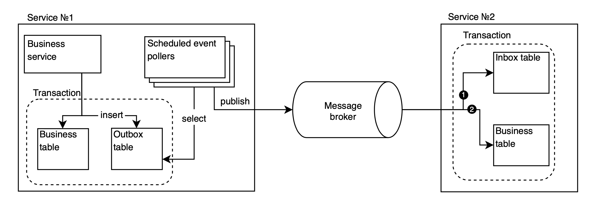

[](https://www.codefactor.io/repository/github/dmitriy-iliyov/spring-outbox)
[](https://codecov.io/github/dmitriy-iliyov/spring-outbox)
[](https://github.com/dmitriy-iliyov/spring-outbox/actions/workflows/ci.yml)
[](https://central.sonatype.com/artifact/io.github.dmitriy-iliyov/spring-outbox-starter)

[](https://github.com/dmitriy-iliyov/spring-outbox/releases/latest)


## Overview
This library provides an implementation of the [Transactional Outbox Pattern](https://microservices.io/patterns/data/transactional-outbox.html) based on polling events from a relational database and publishing them to a message broker.

The library offers flexible configuration for processing different event types.
Each event type is handled independently, and events are processed in parallel using a configurable thread pool, allowing predictable throughput and controlled resource usage.

This approach ensures reliable event publication without relying on database log-based CDC solutions, making it suitable for environments where simplicity, portability, and explicit control over event processing are preferred.

## Key Features
- **Atomic persistence** - events are stored within the same business transaction, ensuring consistency.
- **Adaptive polling** - dynamically adjusts the polling interval based on workload to optimize database usage.
- **Flexible polling configuration** - allows customization of polling intervals, retry policies, and backoff strategies per event type.
- **At-least-once delivery** - guarantees delivery with configurable retries and backoff policies.
- **Effectively-once delivery** - achieved via an idempotent consumer implementation provided by the library.
- **Dead Letter Queue** - stores events that fail after all retry attempts, with REST API support for management.
- **Background service** - handles recovery of stuck events and cleanup of processed or consumed events automatically.
- **Observability** - provides out-of-the-box metrics integration via Micrometer.

## Supported Infrastructure

- **Databases:** PostgreSQL 16+, MySQL 8+, Oracle 23+.
- **Message Brokers:** Apache Kafka 3.7+, RabbitMQ 3.12+.
- **Cache Storage (optional for caching):** Redis 7+.

## Limitations
- **Horizontal scaling** - performance degradation may occur when reaching a certain number of instances due to `SKIP LOCKED` - based concurrent polling mechanism. The optimal number of instances depends on the number of event types and database load.
- **No ordering guarantees** - events are processed in parallel by type, with no guaranteed delivery order within or across event types.

## Quick Start

1. Add dependency

For Apache Kafka:
```xml
  <dependency>
      <groupId>io.github.dmitriy-iliyov</groupId>
      <artifactId>spring-outbox-starter</artifactId>
      <version>1.1.0</version>
  </dependency>

  <dependency>
      <groupId>io.github.dmitriy-iliyov</groupId>
      <artifactId>spring-outbox-kafka</artifactId>
      <version>1.1.0</version>
  </dependency>
```
For RabbitMQ:
```xml
  <dependency>
      <groupId>io.github.dmitriy-iliyov</groupId>
      <artifactId>spring-outbox-starter</artifactId>
      <version>1.1.0</version>
  </dependency>

  <dependency>
      <groupId>io.github.dmitriy-iliyov</groupId>
      <artifactId>spring-outbox-rabbit</artifactId>
      <version>1.1.0</version>
  </dependency>
```
You can also add `spring-outbox-dlq-api` for enable REST API for manual DLQ managing, read more [here](#dlq-rest-api).
```xml
  <dependency>
      <groupId>io.github.dmitriy-iliyov</groupId>
      <artifactId>spring-outbox-dlq-api</artifactId>
      <version>1.1.0</version>
  </dependency>
```

2. Enable starter on publisher side:
```java
@SpringBootApplication 
@EnableTransactionManagement
@EnableKafka
@EnableOutbox
public class PublisherRunner {

    public static void main(String ... args) {
        SpringApplication.run(PublisherRunner.class, args);
    }
}
```

3. Minimal YAML config:
> [!WARNING]
> DLQ disabled by default.
```yaml
outbox:
  publisher:
    sender:
      type: kafka    # or rabbit
    events:
      create-example-event:
        topic: "example-events"
```

4. Inject `OutboxPublisher`:
```java 
@Service
@RequiredArgsConstructor
public class ExampleService {

    private final ExampleRepository repository;
    private final ExampleMapper mapper;
    private final OutboxPublisher outboxPublisher;
    
    @Transactional
    public ExampleDto save(ExampleCreateDto dto) {
        ExampleEntity entity = repository.save(mapper.toEntity(dto));
        ExampleDto response = mapper.toDto(entity);
        outboxPublisher.publish("create-example-event", response);
        return response;
    }
}
```

Or use `@OutboxPublish` annotation:

```java
@Service
@RequiredArgsConstructor
public class ExampleService {

    private final ExampleRepository repository;
    private final ExampleMapper mapper;

    @Transactional
    @OutboxPublish(eventType = "create-example-event")    // annotation using method result as argument
    public ExampleDto save(ExampleCreateDto dto) {
        ExampleEntity entity = repository.save(mapper.toEntity(dto));
        return mapper.toDto(entity);
    }
}
```

5. Enable starter on consumer side:
```java
@SpringBootApplication
@EnableTransactionManagement
@EnableKafka
@EnableCaching
@EnableOutbox
public class ConsumerRunner {

    public static void main(String [] args) {
        SpringApplication.run(ConsumerRunner.class, args);
    }
}
```

6. Minimal YAML config:
> [!NOTE]
> Cleanup and cache enable by default.

```yaml
outbox:
  publisher:
    enabled: false
  consumer:
    enabled: true
    cache:
      cache-name: "outbox:consumed"
```

7. Create listener with injected `OutboxIdempotentConsumer`:

**Apache Kafka:**
```java
@Component
@RequiredArgsConstructor
@Slf4j
public class ExampleKafkaListener {

    private final OutboxIdempotentConsumer outboxConsumer;

    @KafkaListener(topics = "example-events", groupId = "example-group")
    public void listen(ConsumerRecord<String, ExampleDto> record) {
        outboxConsumer.consume(
                record, () -> log.info("Some business operation with payload {}", record.value())
        );
    }
}
```

**RabbitMQ:**
```java
@Component
@RequiredArgsConstructor
@Slf4j
public class ExampleRabbitListener {

    private final OutboxIdempotentConsumer outboxConsumer;
    private final ObjectMapper objectMapper;
    
    @RabbitListener(queues = "example-queue")
    public void handle(Message message) {
      ExampleDto dto = objectMapper.readValue(message.getBody(), ExampleDto.class);
      outboxConsumer.consume(
            message, () -> log.info("Some business operation with payload {}", dto)
      );
    }
}
```

More about event metadata [here](#event-headers)

---

## Example & Test Environment

Example of full configured project with simple traffic generator is [here](https://github.com/dmitriy-iliyov/spring-outbox/tree/main/spring-outbox-example). Project is fully containerised with Docker.

## Design

### Architecture Overview

The system architecture with full configuration looks as follows:



The event lifecycle follows these steps:
1. Event or batch of events is created
2. Scheduled procedure polls a batch of events by type
3. Attempt to publish the batch:
    - On success: batch is marked as processed
    - On failure: configured number of retries is performed for this event type
        - When retries are exhausted: event is atomically moved to DLQ
4. Event is placed in the message queue

The following flow applies only when using the idempotent consumer:
1. Consumer receives an event or batch of events
2. Consumption check is performed (all subsequent steps are atomic):
    - If event was already consumed: business action is not executed and no exceptions are thrown
        - For batch consumption: events are filtered and business operation executes only for unconsumed events
    - If event was not consumed: event is marked as consumed and business operation is executed

---

### Polling Mechanism

The polling mechanism is based on selecting events by type, sorted by creation date (or by retry date after the first failed delivery attempt).
Events of different types can be processed in parallel using threads from a dedicated library-managed thread pool (you can manage this with `thread-pool-size`).
Detailed configuration options and recommendations for pool size are [here](#global).

To enable parallel event processing across multiple application instances, the library uses `FOR UPDATE SKIP LOCKED`, which allows concurrent processing of event batches. This architectural decision has two drawbacks:
- Performance degrades as the number of instances increases due to longer search times for available event batches
- Event processing order cannot be guaranteed

The library provides two polling strategies: `fixed` and `adaptive`.

The `fixed` strategy uses a constant delay between polling iterations, making it predictable and easier to reason about under stable workloads. 

The `adaptive` strategy dynamically adjusts the delay between polling iterations using exponential backoff. When no events are available, the delay increases (up to `max-fixed-delay`) to reduce unnecessary database load. As soon as events are detected, the delay is reset to `min-fixed-delay`, allowing the system to react quickly to new workload.

Detailed polling configuration options are available [here](#polling).

---

### Delivery Semantics

> [!WARNING]
> The library expects the message broker to be configured by the developer. 
> To ensure the delivery semantics described below, the broker must be configured with `acks` (or an equivalent mechanism). 
> If the broker uses a producer-side buffer, its settings should also be tuned appropriately for the expected load.

#### At-Least-Once

This delivery semantic is ensured without consumer-side configuration. The publisher waits for successful acknowledgment from the queue confirming event receipt.

If the publisher crashes after polling but before sending to the queue, events become stuck in `IN_PROCESS` state. They will be detected by a dedicated worker and transitioned back to `PENDING` state without counting the failed delivery attempt.

More details about the state machine [here](#event-state-machine).

#### Exactly-Once
This semantic is achievable only when using the idempotent consumer, which deduplicates messages based on event identifiers generated when the event is initially saved at the beginning of its lifecycle.

In reality, the term "Exactly-Once" is not entirely accurate and should be understood as "Effectively-Once", since the library cannot guarantee deduplication within the broker itself.

---

### Publisher

#### Usage
There are two options for use:
- manual using `OutboxPublisher#publish()`
```java
public interface OutboxPublisher {
  <T> void publish(String eventType, T event);
  <T> void publish(String eventType, List<T> events);
}
```
- using an `@OutboxPublish` annotation
```java
@Retention(RetentionPolicy.RUNTIME)
@Target(ElementType.METHOD)
@Documented
public @interface OutboxPublish {
  String eventType();
  String payload() default "#result";
}
```
Both approaches require specifying the eventType in accordance with the YAML configuration and support saving events in batches.
When using the annotation-based approach, the payload can be derived from method parameters or the return value and is configured via SpEL expressions (e.g. by referencing a parameter name).
More usage examples [here](https://github.com/dmitriy-iliyov/spring-outbox/blob/main/spring-outbox-example/spring-outbox-producer-example/src/main/java/io/github/dmitriyiliyov/springoutbox/example/producer/OrderService.java).

---

#### Event State Machine
Events transition through the following states:
```text
PENDING → IN_PROCESS → PROCESSED (future cleanup)
               ↓
             FAILED (after max retries exhausted, future transfer to DLQ)
```
- `PENDING`: event created and waiting to be polled
- `IN_PROCESS`: event currently being processed by a publisher instance, if the publisher crashes, the event will remain in this state. This is an intermediate state that signals that an event has been accepted for processing by a worker. All workers except for [stuck event recovery](#stuck-event-recovery) do not work with this status. The state is assigned after a transaction locks a row in the database via FOR UPDATE.
- `PROCESSED`: event successfully sent to message broker
- `FAILED`: event failed after exhausting all retry attempts

---

#### Transactional Guarantees
The library ensures atomic storage of outbox events within the same database transaction as business entity modifications. This guarantees that either both the business change and the event are saved, or neither is saved, preventing inconsistencies between the database and message broker.

All methods for saving simultaneously with a business event are annotated with `@Transactional(propagation = Propagation.MANDATORY)`, which means that the transaction is mandatory and is opened by the client code.

---

#### Serialization

The library uses Jackson-based serialization by default, but if necessary, you can define your own by implementing `OutboxSerializer`:
```java
public interface OutboxSerializer {
    
    <T> OutboxEvent serialize(String eventType, T event);
    
    <T> List<OutboxEvent> serialize(String eventType, List<T> rowEvents);
}
```

---

#### Retry Policy
An exponential backoff is supported where the delay increases exponentially with each retry, the next retry attempt is calculated using the following formula:

`next_retry_at = delay * (multiplier ^ retry_attempt)`

Example: 10s -> 30s -> 90s -> 270s...

Detailed configuration options are available [here](#defaults--events).

---

#### Stuck Event Recovery
Events that are in the `IN_PROCESS` state for more than the specified threshold (`max-batch-processing-time` in the configuration) are considered stuck, they are caught by the worker and transferred to the `PENDING` state **without increasing the number of failed attempts**.

Detailed configuration options are available [here](#stuck-event-recovery-1).

---

#### Dead Letter Queue

The Dead Letter Queue is implemented using the database. As described above, events are automatically moved to the DLQ once they are marked with the `FAILED` status after the maximum number of retry attempts is exceeded.

Events placed into the DLQ must be **manually reviewed**. After review, an event can be marked as either `TO_RETRY` or `RESOLVED`.  
To support this workflow, the library provides a **REST API** for DLQ management with the following capabilities.

Each DLQ event follows a defined state machine:
```text
MOVED → IN_PROCESS → RESOLVED (future cleanup or manually delete)
            ↓
         TO_RETRY (returned to outbox_events and deleted from outbox_dlq_events)
```
State definitions:

- `MOVED`: the event has been transferred from `outbox_events` to the DLQ and is waiting for manual review
- `IN_PROCESS`: the event is currently being processed by a DLQ transfer worker
- `TO_RETRY`: the event has been reviewed and approved for retry; it will be moved back to `outbox_events`
- `RESOLVED`: the event is considered permanently failed and will not be retried

##### DLQ Transfer Semantics

Event transfers between `outbox_events` and `outbox_dlq_events` are performed **within a single database transaction** to ensure consistency:

- start transaction
    - load a batch of DLQ events and lock them by setting status to `IN_PROCESS` to prevent concurrent handling
    - insert events into the target table
    - delete the corresponding batch from the source table
- commit transaction

This guarantees atomicity and prevents event duplication or loss during DLQ transitions.

There is a handler interface that is invoked when events are transferred from the `outbox_events` table to the `outbox_dlq_events` table.
It can be used to integrate alerting or monitoring.
By default, it simply logs the events moved to the DLQ.
```java
public interface OutboxDlqHandler {
    void handle(List<OutboxEvent> events);
}
```

##### DLQ REST API
The Dead Letter Queue provides a REST API for managing events that have failed delivery or require manual review.

> [!WARNING]
> You should secure DLQ REST API paths.

| Method                                                | Path                           | Params                                                                                | Request Body                                                         | Description                                                                                           |
|:------------------------------------------------------|:-------------------------------|:--------------------------------------------------------------------------------------|:---------------------------------------------------------------------|-------------------------------------------------------------------------------------------------------|
|        | `/api/outbox-dlq/events/{id}`  | id: UUID                                                                              | —                                                                    | Get DLQ event by ID                                                                                   |
|        | `/api/outbox-dlq/events/batch` | status: DlqStatus, <br/>eventType: String, <br/>batchNumber: int, <br/>batchSize: int | —                                                                    | Get batch of DLQ events by status or eventType, returnig without sort all if the parameter is missing |
|        | `/api/outbox-dlq/events/count` | status: DlqStatus, <br/>eventType: String                                             | —                                                                    | Get the number of DLQ by status or eventType, count all if the parameter is missing                   |
|    | `/api/outbox-dlq/events/{id}`  | id: UUID                                                                              | status: DlqStatus                                                    | Update single DLQ event status                                                                        |
|    | `/api/outbox-dlq/events/batch` | —                                                                                     | ids: Set&lt;UUID&gt;, <br/>eventType: String, <br/>status: DlqStatus | Update batch DLQ events status by status or eventType, not both                                       |
|  | `/api/outbox-dlq/events/{id}`  | id: UUID                                                                              | —                                                                    | Delete single DLQ event                                                                               |
|  | `/api/outbox-dlq/events/batch` | —                                                                                     | ids: Set&lt;UUID&gt;, <br/>eventType: String                         | Delete batch of DLQ events by status or eventType, not both                                           |

Detailed DLQ configuration options are available [here](#dead-letter-queue-1).

---

#### Cleanup

Outbox events with the `PROCESSED` status are periodically cleaned up by a background worker according to the configured retention policy.
Detailed configuration options are available [here](#cleanup-2).

---

### Consumer

#### Usage
The consumer side of the library provides only manual invocation through the following interface:
```java
public interface OutboxIdempotentConsumer {
    <T> void consume(T message, Runnable operation);
    <T> void consume(List<T> messages, Consumer<List<T>> operation);
}
```
More usage examples [here](https://github.com/dmitriy-iliyov/spring-outbox/blob/main/spring-outbox-example/spring-outbox-consumer-example/src/main/java/io/github/dmitriyiliyov/springoutbox/example/consumer/OrderAnalyticKafkaListener.java)

---

#### Idempotent Processing
Idempotent processing is implemented through unique event identifiers that are stored in a dedicated table when consumed. Storage occurs atomically together with the business effect.

Event identifiers are passed via message headers to avoid polluting business events, so you should use for:
- Apache Kafka - `org.apache.kafka.clients.consumer.ConsumerRecord`
- RabbitMQ - `org.springframework.amqp.core.Message`

As mentioned earlier, when consuming a batch of events, already-consumed events are filtered out and only unconsumed events are passed to the lambda expression.

For improved performance, consumed event identifiers can be cached in a distributed cache. When using this feature, ensure that cleanup of successfully processed events occurs after cache cleanup to prevent data loss.
The library uses `CacheManager` from the application context. Cache configuration must be provided by the developer.

---

#### Event Headers

> [!IMPORTANT]
> The library uses message headers to pass event metadata for idempotency checks and routing.

The event types themselves act as routing keys in both cases. For **Apache Kafka**, they are placed in event headers and are available for consumer-side routing. For **RabbitMQ**, they are used by the library itself to determine the queue to which the event will be sent and are also available in the headers.

All events published through the outbox pattern include the following headers:

| Header Name         | Constant                   |   Type   | Description                                                                              |
|---------------------|----------------------------|:--------:|------------------------------------------------------------------------------------------|
| `outbox_event_type` | `OutboxHeaders.EVENT_TYPE` |  String  | Enables event dispatching when multiple event types share a topic/exchange               |
| `outbox_event_id`   | `OutboxHeaders.EVENT_ID`   |   UUID   | Unique event identifier for idempotency, used by OutboxIdempotentConsumer implementation |                                                                                               |

**Apache Kafka:**
```java
@Component
@RequiredArgsConstructor
@Slf4j
public class OrderKafkaListener {

  private final OutboxIdempotentConsumer outboxConsumer;

  private final Map<String, OrderEventHandler> handlers;

  @KafkaListener(topics = "orders", groupId = "order-group")
  public void listen(ConsumerRecord<String, OrderDto> record) {
    String eventType = new String(
            record.headers()
                    .lastHeader(OutboxHeaders.EVENT_TYPE.getValue())
                    .value()
    );

    outboxConsumer.consume(record, () -> {
      OrderEventHandler handler = handlers.get(eventType);
      if (handler != null) {
        handler.handle(record);
      }
    });
  }
}
```

**RabbitMQ:**
```java
@Component
@RequiredArgsConstructor
@Slf4j
public class OrderRabbitListener {

  private final OutboxIdempotentConsumer outboxConsumer;

  private final Map<String, OrderEventHandler> handlers;

  @RabbitListener(bindings = @QueueBinding(
          value = @Queue("order-processing-queue"),
          exchange = @Exchange(name = "orders", type = ExchangeTypes.TOPIC),
          key = {"order-created", "order-updated"}
  ))
  public void handleOrders(Message message) {
    String eventType = (String) message.getMessageProperties()
            .getHeaders()
            .get(OutboxHeaders.EVENT_TYPE.getValue());

    outboxConsumer.consume(message, () -> {
      OrderEventHandler handler = handlers.get(eventType);
      if (handler != null) {
        handler.handle(message);
      }
    });
  }
}
```
---

#### Cleanup
The automatic cleanup strategy for consumed events is identical to the publisher cleanup strategy described [above](#cleanup).

---

## Observability
### Publisher

> [!NOTE]
> The term 'tasks' encompasses both internal outbox background processes and actual event processing.

**Gauges**

| Metric Name                                  | Description                             | Tags                                                                                                                     |
|:---------------------------------------------|:----------------------------------------|:-------------------------------------------------------------------------------------------------------------------------|
| `outbox_events`                              | Total number of outbox events           | —                                                                                                                        |
| `outbox_events_by_status`                    | Number of outbox events by status       | `status={pending, in_process}`                                                                                           |
| `outbox_events_by_event_type_and_status`     | Number of outbox events by type         | `event_type`, <br/>`status={pending, in_process}`                                                                        |
| `outbox_dlq_events`                          | Total number of events in DLQ           | —                                                                                                                        |
| `outbox_dlq_events_by_status`                | Number of DLQ events by status          | `status={moved, in_process, to_retry}`                                                                                   |
| `outbox_dlq_events_by_event_type_and_status` | Number of DLQ events by type and status | `event_type`, <br/>`status={moved, in_process, to_retry}`                                                                |
| `outbox_polling_delay_milliseconds`          | Current delay between tasks execution   | `task_type={clean-up-processed-events, stuck-event-recovery, transfer-to-dlq, transfer-from-dlq}` or declared event type |

All event related gauges execute `COUNT` queries against the database and therefore reflect the **exact number of events at the current moment**.

To avoid excessive database load caused by Prometheus scraping, gauge values are **cached by default**.
Caching can be disabled via metrics configuration.

**Counters**

| Metric Name                                                                                                                      | Description                    | Tags                                                                                                                     |
|:---------------------------------------------------------------------------------------------------------------------------------|:-------------------------------|:-------------------------------------------------------------------------------------------------------------------------|
| `outbox_events_rate_total`                                                                                                       | Processed events rate          | `event_type`, <br/>`status={processed}`                                                                                  |
| `outbox_events_by_action_type_rate_total`                                                                                        | Internal lifecycle events rate | `action_type={attempt_move_to_dlq, recovered, cleaned, success_moved_to_dlq}`                                            |
| `outbox_dlq_events_by_action_type_rate_total`                                                                                    | DLQ operational events rate    | `action_type={attempt_move_to_outbox, success_moved_to_outbox, manual_deleted}`                                          |
| `outbox_started_tasks_total`<br/>`outbox_skipped_tasks_total`<br/>`outbox_succeeded_tasks_total`<br/>`outbox_failed_tasks_total` | Rate of task execution states  | `task_type={clean-up-processed-events, stuck-event-recovery, transfer-to-dlq, transfer-from-dlq}` or declared event type |

**Timers**

| Metric Name                       | Description                 | Tags                                                                                                                     |
|:----------------------------------|:----------------------------|:-------------------------------------------------------------------------------------------------------------------------|
| `outbox_task_processing_duration` | Duration of task processing | `task_type={clean-up-processed-events, stuck-event-recovery, transfer-to-dlq, transfer-from-dlq}` or declared event type |

These timers help identify performance bottlenecks during bulk recovery or DLQ reprocessing operations.

---

### Consumer

**Gauges**

| Metric Name                         | Description                           | Tags                                   |
|:------------------------------------|:--------------------------------------|:---------------------------------------|
| `outbox_polling_delay_milliseconds` | Current delay between tasks execution | `task_type={clean-up-consumed-events}` |


**Counters**

| Metric Name                                                                                                                      | Description                                        | Tags                                                    |
|:---------------------------------------------------------------------------------------------------------------------------------|:---------------------------------------------------|:--------------------------------------------------------|
| `consumed_outbox_events_total`                                                                                                   | Number of consumed outbox events by specific type  | `type={rejected_duplicates, consumed, cleaned, failed}` |
| `consumed_outbox_cache_action_total`                                                                                             | Number of hit/miss in consumed outbox events cache | `action_type={hit, miss}`                               |
| `outbox_started_tasks_total`<br/>`outbox_skipped_tasks_total`<br/>`outbox_succeeded_tasks_total`<br/>`outbox_failed_tasks_total` | Rate of task execution states                      | `task_type={clean-up-consumed-events}`                  |

**Timers**

| Metric Name                       | Description                 | Tags                                   |
|:----------------------------------|:----------------------------|:---------------------------------------|
| `outbox_task_processing_duration` | Duration of task processing | `task_type={clean-up-consumed-events}` |

## Configuration
### Global
When calculating the thread pool size, it's important to account for all background system processes. 

Publisher requires three threads for its background operations (stuck event recovery, DLQ transfers and cleanup), 
plus one additional thread for each configured event type. Therefore, the recommended number of threads is `3 + n`, where `n` is the number of event types.

Consumer side requires only one thread for cleanup as background operation, the number of threads is `1`.

```yaml
outbox:
  thread-pool-size: 5
  tables:
    auto-create: true
```

| Property           | Description                                                                                                                                                                                                                                     | Default                         |
|--------------------|-------------------------------------------------------------------------------------------------------------------------------------------------------------------------------------------------------------------------------------------------|:--------------------------------|
| `thread-pool-size` | Size of the thread pool for parallel event processing                                                                                                                                                                                           | `min(available_processors, 5)`  |
| `auto-create`      | Automatically create outbox tables on startup. Create 3 tables: <br/>- `outbox_events`; <br/>- `outbox_dlq_events` (when `outbox.publisher.dlq.enabled` is `true`); <br/>- `outbox_consumed_events` (when `outbox.consumer.enabled` is `true`). | `true`                          |

### Publisher

#### Sender
```yaml
outbox:
  publisher:
    sender:
      type: kafka
      bean-name: "customKafkaTemplate"
      emergency-timeout: 120s
```

| Property            | Description                                  | Default                                               |
|---------------------|----------------------------------------------|:------------------------------------------------------|
| `type`              | Message broker type (`kafka` or `rabbit`)    | —                                                     |
| `bean-name`         | Custom sender bean name for multiple senders | Try resolving by Java type according to `sender.type` |
| `emergency-timeout` | Maximum time to wait for a send operation    | `120s`                                                |

---

#### Polling
The library supports two polling strategies: `fixed` and `adaptive`.

Example configuration for `adaptive` polling:
```yaml
polling: 
  type: adaptive
  initial-delay: 300s
  min-fixed-delay: 1s
  max-fixed-delay: 1m
  multiplier: 2.0
```

Example configuration for `fixed` polling:
```yaml
polling: 
  type: fixed
  initial-delay: 300s
  fixed-delay: 2s
```

| Property          | Description                                                            |
|-------------------|------------------------------------------------------------------------|
| `type`            | Polling type (`fixed` or `adaptive`)                                   |
| `initial-delay`   | Delay before first polling starts                                      |
| `fixed-delay`     | Fixed delay between polling iterations (used for `fixed` polling type) |
| `min-fixed-delay` | Min delay between polling iterations                                   |
| `max-fixed-delay` | Max delay between polling iterations                                   |
| `multiplier`      | Multiplier for exponential backoff between polling iterations          |

> [!NOTE]
> Polling does not have global defaults. Each property group-such as defaults, current event, cleanup, stuck recovery, and DLQ transfers-has its own polling default values. 
---

#### Defaults & Events

The `defaults` section defines default values that apply to all events unless overridden in individual event configuration.
```yaml
outbox:
  publisher:
    defaults:
      batch-size: 200
      polling:
        type: adaptive
        initial-delay: 5m
        min-fixed-delay: 250ms
        max-fixed-delay: 1m
        multiplier: 1.5
      max-retries: 3
      backoff:
        enabled: true
        delay: 10s
        multiplier: 3.0
```

| Property                  | Description                                                                                                          |  Default   |
|---------------------------|----------------------------------------------------------------------------------------------------------------------|:----------:|
| `batch-size`              | Number of events to process per iteration                                                                            |   `200`    |
| `polling.type`            | Polling type (`fixed` or `adaptive`)                                                                                 | `adaptive` |
| `polling.initial-delay`   | Delay before first polling starts                                                                                    |    `5m`    |
| `polling.min-fixed-delay` | Min delay between polling iterations                                                                                 |  `250ms`   |
| `polling.max-fixed-delay` | Max delay between polling iterations                                                                                 |    `1m`    |
| `polling.multiplier`      | Multiplier for exponential backoff between polling iterations                                                        |   `1.5`    |
| `max-retries`             | Maximum retry attempts before moving to DLQ                                                                          |    `3`     |
| `backoff.enabled`         | Enable exponential backoff for retries                                                                               |   `true`   |
| `backoff.delay`           | Initial backoff delay                                                                                                |   `10s`    |
| `backoff.multiplier`      | Multiplier for exponential backoff                                                                                   |   `3.0`    |

Individual event configurations override defaults for specific event types.

Apache Kafka example:
```yaml
outbox:
  publisher:
    events:
      create-order:
        topic: orders
        batch-size: 500
        polling:
          min-fixed-delay: 1s
        max-retries: 2
        backoff:
          delay: 5s
          multiplier: 2.0

      update-order:
        topic: orders
        batch-size: 200
        polling:
          type: fixed
          initial-delay: 10m
          fixed-delay: 250ms
        backoff:
          enabled: false  # Use fixed delay instead

      delete-order:
        topic: orders
        batch-size: 500
        polling:
          max-fixed-delay: 5m
          multiplier: 5.0
```
| Property | Description                                           |
|----------|-------------------------------------------------------|
| `topic`  | Destination topic (Kafka) or exchange (RabbitMQ) name |

All other parameters same as `defaults` section, but override defaults for this specific event type

RabbitMQ example:
```yaml
outbox:
  publisher:
    events:
      create-order:
        topic: orders-exchange
        batch-size: 500
        polling:
          min-fixed-delay: 1s
        max-retries: 2
        backoff:
          delay: 5s
          multiplier: 2.0

      update-order:
        topic: orders-exchange
        batch-size: 200
        polling:
          type: fixed
          initial-delay: 10m
          fixed-delay: 250ms
        backoff:
          enabled: false  # Use fixed delay instead
      
      delete-order:
        topic: orders-exchange
        batch-size: 500
        polling:
          max-fixed-delay: 5m
          multiplier: 5.0
```

**Example with inheritance from `defaults`:**
```yaml
outbox:
  publisher:
    defaults:
      batch-size: 200
      polling:
        type: adaptive
        initial-delay: 5m
        min-fixed-delay: 1s
        max-fixed-delay: 1m
        multiplier: 1.5
      max-retries: 3
      backoff:
        enabled: true
        delay: 10s
        multiplier: 3.0
    
    events:
      high-priority:
        topic: events
        min-fixed-delay: 250ms  # Override: faster polling
        # Inherits: batch-size=200, other polling settings, max-retries=3, backoff 
      
      low-priority:
        topic: events
        polling:
          min-fixed-delay: 10s  # Override: slower polling
          max-fixed-delay: 5m
          multiplier: 2.0
        backoff:
          enabled: false  # Override: disable backoff
          # Inherits: batch-size=200, other polling settings, max-retries=3
```
---

#### Stuck Event Recovery
```yaml
outbox:
  publisher:
    stuck-recovery:
      batch-size: 500
      max-batch-processing-time: 300s
      polling:
        type: adaptive
        initial-delay: 5m
        min-fixed-delay: 1s
        max-fixed-delay: 1m
        multiplier: 4.0
```

| Property                    | Description                                                                                                          |  Default   |
|-----------------------------|----------------------------------------------------------------------------------------------------------------------|:----------:|
| `batch-size`                | Number of stuck events to recover per iteration                                                                      |   `500`    |
| `max-batch-processing-time` | Time threshold for detecting stuck events (events in `IN_PROCESS` longer than this are considered stuck)             |   `300s`   |
| `polling.type`              | Polling type (`fixed` or `adaptive`)                                                                                 | `adaptive` |
| `polling.initial-delay`     | Delay before first polling starts                                                                                    |    `5m`    |
| `polling.min-fixed-delay`   | Min delay between polling iterations                                                                                 |    `1s`    |
| `polling.max-fixed-delay`   | Max delay between polling iterations                                                                                 |    `1m`    |
| `polling.multiplier`        | Multiplier for exponential backoff between polling iterations                                                        |   `4.0`    |
---

#### Dead Letter Queue
```yaml
outbox:
  publisher:
    dlq:
      enabled: true  
      batch-size: 500
      polling:
        type: adaptive
        initial-delay: 5m
        min-fixed-delay: 1s
        max-fixed-delay: 2m
        multiplier: 10.0
      transfer-to:
        # All properties inherit from section above
      transfer-from:
        # All properties inherit from section above
```
DLQ has shared section with `batch-size`, `polling`. Values from this section will be used in `transfer-to` and `transfer-from` as defaults.
> [!WARNING]
> When disabled, failed events are not managed automatically and stay in `outbox_events` as `FAILED`.

| Property                  | Description                                                                                                          |  Default   |
|---------------------------|----------------------------------------------------------------------------------------------------------------------|:----------:|
| `enabled`                 | Enable DLQ functionality                                                                                             |  `false`   |
| `batch-size`              | Number of events to transfer per iteration                                                                           |   `500`    |
| `polling.type`            | Polling type (`fixed` or `adaptive`)                                                                                 | `adaptive` |
| `polling.initial-delay`   | Delay before first polling starts                                                                                    |    `5m`    |
| `polling.min-fixed-delay` | Min delay between polling iterations                                                                                 |    `1s`    |
| `polling.max-fixed-delay` | Max delay between polling iterations                                                                                 |    `2m`    |
| `polling.multiplier`      | Multiplier for exponential backoff between polling iterations                                                        |   `10.0`   |
| `transfer-to`             | Section for specifying settings for transferring events from the outbox to the DLQ                                   |     —      |
| `transfer-from`           | Section for specifying settings for transferring events from the DLQ to the outbox                                   |     —      |

**Override example**: 
```yaml
outbox:
  publisher:
    dlq:
      enabled: true  
      batch-size: 500
      polling:
        type: adaptive
        initial-delay: 5m
        min-fixed-delay: 1s
        max-fixed-delay: 2m
        multiplier: 10.0
      transfer-to:
        pooling:
          multiplier: 2.5
      # Inherits: batch-size=500, other polling settings except multiplier
      transfer-from:
        batch-size: 1000
        pooling:
          type: fixed
          initial-delay: 5m
          fixed-delay: 1m
        # Nothing inherits
```
---

#### Cleanup
```yaml
outbox:
  publisher:
    clean-up:
      enabled: true
      batch-size: 500
      ttl: 24h
      polling:
        type: adaptive
        initial-delay: 5m
        min-fixed-delay: 5s
        max-fixed-delay: 1m
        multiplier: 2.0
```

> [!WARNING]
> When disabled, processed events will accumulate indefinitely.

| Property                  | Description                                                                                                          |  Default   |
|---------------------------|----------------------------------------------------------------------------------------------------------------------|:----------:|
| `enabled`                 | Enable automatic cleanup of processed events                                                                         |   `true`   |
| `batch-size`              | Number of events to delete per iteration                                                                             |   `500`    |
| `ttl`                     | TTL for processed events. Events with `PROCESSED` status older than this are deleted                                 |   `24h`    |
| `polling.type`            | Polling type (`fixed` or `adaptive`)                                                                                 | `adaptive` |
| `polling.initial-delay`   | Delay before first polling starts                                                                                    |    `5m`    |
| `polling.min-fixed-delay` | Min delay between polling iterations                                                                                 |    `5s`    |
| `polling.max-fixed-delay` | Max delay between polling iterations                                                                                 |    `1m`    |
| `polling.multiplier`      | Multiplier for exponential backoff between polling iterations                                                        |   `2.0`    |

---

#### Metrics
```yaml
outbox:
  publisher:
    metrics:
      enabled: true
      gauge:
        enabled: true
        cache:
          ttls: [60s, 60s, 30s]
```
| Property              | Description                                        |       Default       |
|-----------------------|----------------------------------------------------|:-------------------:|
| `metrics.enabled`     | Enable metrics collection                          |       `false`       |
| `gauge.enabled`       | Enable gauge metrics collection                    |       `false`       |
| `gauge.cache.enabled` | Enable cache (false when `gauge.enabled` is false) |       `false`       |
| `gauge.cache.ttls`    | TTL for caching different gauge metric values      |  `[60s, 60s, 60s]`  |

This enable metrics collecting and gauges with cache default ttls:
```yaml
outbox:
  publisher:
    metrics:
      enabled: true
```
---

### Consumer

#### Cleanup
```yaml
outbox:
  consumer:
    clean-up:
      enabled: true
      batch-size: 500
      ttl: 24h
      polling:
        type: adaptive
        initial-delay: 5m
        min-fixed-delay: 5s
        max-fixed-delay: 1m
        multiplier: 2.0
```
All parameters same as [Publisher Cleanup](#cleanup-2).

---

#### Cache
The library uses Spring's `CacheManager` from application context.
```yaml
outbox:
  consumer:
    cache:
      enabled: true
      cache-name: "outbox:consumed"
```

> [!WARNING]
> When disabled, idempotency check always hits database.

| Property     | Description                                                                                                                                           |  Default  |
|--------------|-------------------------------------------------------------------------------------------------------------------------------------------------------|:---------:|
| `enabled`    | Enable distributed caching of consumed event ids                                                                                                      |  `false`  |
| `cache-name` | Name of the cache in CacheManager (**required** when `consumer.cache.enabled` is true). Must match cache name configured in your `CacheManager` bean. |     —     |

---

#### Metrics
```yaml
outbox:
  consumer:
    metrics:
      enabled: true
```

| Property          | Description               |  Default  |
|-------------------|---------------------------|:---------:|
| `metrics.enabled` | Enable metrics collection |  `false`  |

---

### Examples
#### Producer-Only
Minimal:
> [!WARNING]
> Dead Letter Queue and Metrics Collecting are disabled by default. All other values will use defaults.

```yaml
outbox:
  publisher:
    sender:
      type: kafka
    events:
      my-event:
        topic: my.topic
```
Minimal with all features:

```yaml
outbox:
  publisher:
    sender:
      type: kafka
    events:
      my-event:
        topic: my.topic
    dlq:
      enabled: true
    metrics:
      enabled: true
      gauge:
        enabled: true
```

Full:
```yaml
outbox:
  thread-pool-size: 5
  tables:
    auto-create: true
    
  publisher:
    sender:
      type: kafka
      emergency-timeout: 120s

    defaults:
      batch-size: 200
      polling:
        type: adaptive
        initial-delay: 5m
        min-fixed-delay: 250ms
        max-fixed-delay: 1m
        multiplier: 1.5
      max-retries: 3
      backoff:
        enabled: true
        delay: 10s
        multiplier: 3.0
    
    events:
      # Your events with specific polling, retry, backoff values 
    
    stuck-recovery:
      batch-size: 500
      max-batch-processing-time: 300s
      polling:
        type: adaptive
        initial-delay: 5m
        min-fixed-delay: 1s
        max-fixed-delay: 1m
        multiplier: 4.0
    
    clean-up:
      enabled: true
      batch-size: 200
      ttl: 24h
      polling:
        type: adaptive
        initial-delay: 5m
        min-fixed-delay: 500ms
        max-fixed-delay: 1m
        multiplier: 2.0
    
    dlq:
      enabled: true
      batch-size: 500
      polling:
        type: adaptive
        initial-delay: 5m
        min-fixed-delay: 1s
        max-fixed-delay: 2m
        multiplier: 10.0
      transfer-to:
        # Specific to DLQ polling settings if necessary
      transfer-from:
        # Specific from DLQ polling settings if necessary
    metrics:
      enabled: true
      gauge:          
        enabled: true
        cache:
          ttls: [60s, 60s, 60s]
```

---

#### Consumer-Only
Minimal:

> [!WARNING]
> Clean up and cache enable by default, metrics disable.

```yaml
outbox:
  publisher:
    enabled: false
  consumer:
    enabled: true
    cache:
      cache-name: "outbox:consumed"
```

Minimal with all features:
```yaml
outbox:
  publisher:
    enabled: false
  consumer:
    enabled: true
    cache:
      cache-name: "outbox:consumed"
    metrics:
      enabled: true
```

Full:
```yaml
outbox:
  thread-pool-size: 2
  tables:
    auto-create: true

  publisher:
    enabled: false

  consumer:
    enabled: true
    clean-up:
      enabled: true
      batch-size: 200
      ttl: 24h
      polling:
        type: adaptive
        initial-delay: 5m
        min-fixed-delay: 500ms
        max-fixed-delay: 1m
        multiplier: 2.0
    cache:
      enabled: true
      cache-name: "outbox:consumed"
    metrics:
      enabled: true
```